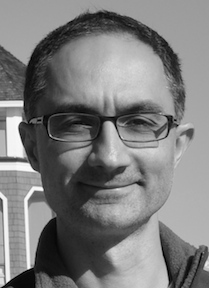

Dr. Robert Babak Faryabi is an Assistant Professor of [Pathology and Laboratory Medicine](http://pathology.med.upenn.edu/) and a member of the [Abramson Family Cancer Research Institute](http://www.afcri.upenn.edu/). After a postdoctoral training with Dr. Andre Nussenzweig at the NIH/NCI [Laboratory of Genome Integrity](https://ccr.cancer.gov/Laboratory-of-Genome-Integrity), Dr. Faryabi joined the [Perelman School of Medicine](http://www.med.upenn.edu/) at the [University of Pennsylvania](http://www.upenn.edu/) in June 2015. His research interest spans the areas of cancer biology, epigenetics and computational biology.
