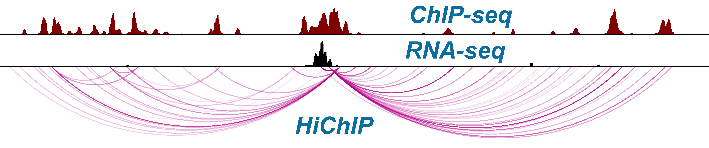

{:height="200%" width="200%"} 

Our lab focuses on understanding the mechanism of epigenetic dysregulation in cancer. We are particularly interested in elucidating how oncogenic signals such as Notch contribute to tumor pathogenicity through regulating its epigenetic program, and to leverage this mechanistic understanding for improved treatments. 

The lab mainly studies cancers with frequent mutations in Notch receptor families. We use combination of wet and dry techniques to understand how oncogenic Notch drives regulatory program in these tumors. Our lab benefits from various established data-rich assays and combine them with novel technologies such as [HiChIP](https://www.nature.com/nmeth/journal/v13/n11/full/nmeth.3999.html) and [10X Genomics](https://www.10xgenomics.com/single-cell/) to elucidate the mechanisms of epigenetic dysregulation in Notch-driven tumors at both population and single cell levels.

<strong>We are always looking for passionate individuals who are interested in investigating cancer epigenomics using combination of experimental and computational approaches.<strong>   
   
Rotation students and postodcs could use wet and/or dry approaches to investigate the impact of epigenetics heterogeneity in tumor biology. Read about our [research](research.html) and checkout [here](positions.html) if you are interested in joining our team or doing rotation in the lab. 

Rotation Projects:
+ How does an oncogene reorganize tumor three-dimensional genome?
+ What are the tumor-specific drivers of long-range regulatory circuitry?
+ How does long-range regulatory circuitry can be used to target non-druggable oncogenes?
+ How does epigenetic plasticity drive resistance to targeted therapies?

----
<strong>NEWS:<strong>
+ Our work entitled ''Classes of ITD predict outcomes in AML patients treated with FLT3 inhibitors,'' has been accepted for publication in Clinical Cancer Research (July 2018). A video clip related to this project at the [Penn Center for Precision Medicine](https://www.youtube.com/watch?v=vqLXfHXP98A&index=20&list=PLRGEsZTjjo8mLReT4vqHU6cc_d4hn46GV)

+ Congratulations to Gregory and the rest of the team for their interesting work, ''[Differential integration of transcriptome and proteome identifies pan-cancer prognostic biomarkers](https://goo.gl/pvZ4Dn)'', published at the Frontiers in Genetics. (June 2018)

+ A preprint of the Gregory's manuscript titled ''Classes of ITD predict outcomes in patients with AML treated with FLT3 inhibitors'' is now on [bioRxiv](https://www.biorxiv.org/content/early/2018/05/14/322354). (June 2018)

+ The lab received the Susan G. Komen's New Treatments for Drug-Resistant Breast Cancers award to study the mechanisms of epigenetic dysregulation in breast cancer. (April 2018). 

+ Gregory recieved travel award to present his work at the Biology of Genomes Cold Spring Harbor Conference (April 2018).  

+ Yeqiao joined the lab as a PhD student. Welcome Yeqiao! (March 2018)

+ A short video clip summarizing our AML precision prognostic project is posted at the [Penn Center for Precision Medicine](https://www.youtube.com/watch?v=vqLXfHXP98A&index=20&list=PLRGEsZTjjo8mLReT4vqHU6cc_d4hn46GV) (January 2018).

+ Gregory's software was highlighted at the [Penn Medicine News](https://www.pennmedicine.org/news/news-releases/2017/july/penn-center-for-precision-medicine-awards-565-000-in-second-accelerator-grants)

+ [Abramson Family Cancer Research Institute](http://www.afcri.upenn.edu/) funded our project to investigate the mechanism of epigenetic dysregulation in breast cancer. (November 2017)

+ Congratulations to Jelena and Yeqiao for their great work, ''A unique B-cell regulome links Notch to downstream oncogenic pathways in small B-cell lymphoma'', that was just accepted to Cell Reports. (September 2017) 

+ Welcoming new member of the lab: [10X Genomics Chromium](https://www.10xgenomics.com/single-cell/) (August 2017)

+ Thanks to Jelena Petrovic and Yeqiao Zhou, our first map of breast cancer genome topology is ready! (June 2017) 

+ Our lab is featured on the [Pathology News](http://pathology.med.upenn.edu/news/faryabi-lab-receives-grant-transdisciplinary-awards-program-translational-medicine-and). 

+ Our paper titled [''Functional proteogenomics reveals biomarkers and therapeutic targets in lymphomas''](http://www.pnas.org/content/114/25/6581.short) is now online at PNAS.

+ Penn Center for Precision Medicine [(PCPM)](https://lp.pennmedicine.org/precision-medicine/general?hcmacid=pm) funded our proposal to study precision clinical decision making in targeted therapy of AML.

+ Thomas Campbell started his rotaion at the first week of May 2017.

+ Ben Kahn and Rohan Alur joined the lab for their independent studies in February 2017. Welcome Ben and Rohan.

+ The lab received the Cooper Scholar Award from the [Abramson Cancer Center's](https://www.pennmedicine.org/cancer). 

+ Our Penn Epigenetics Pilot Grant was renewed till 2018. Thanks [The PENN Epigenetics Institute](https://hosting.med.upenn.edu/epigenetics/)!

+ Institute for Translational Medicine and Therapeutics [(ITMAT)](http://www.itmat.upenn.edu/) supported our proposal for single cell epigenomics study of Leukemia.

+ After more than a year researching in the lab, Yeqiao Zhao was admitted to the Genetics & Epigenetics PhD program at UPenn. Congratulations Yeqiao! 

  
<strong>In collaboration with Dr. Vahedi's lab, we stablished a weekly [computational journal club](https://github.com/VahediLab/ComputationalJournalClub/blob/master/Schedule.md). It is an open venue for everything genomics. Join us on Fridays at 5 pm in the BRB305 to discuss computational biology and have a beer or two!).<strong>

