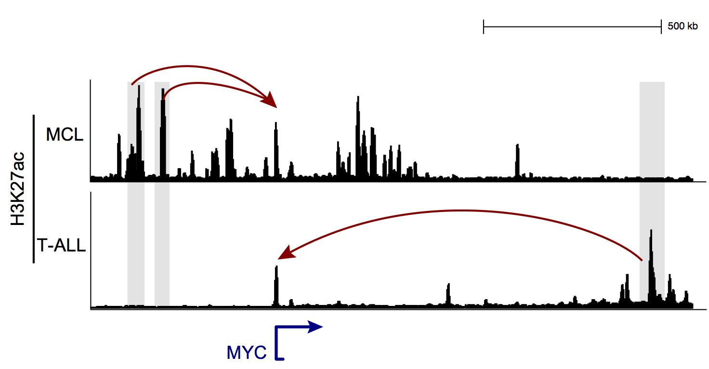

We are a computational biology lab with focus on cancer epigenomics. Our research spans the areas of cancer biology, computational biology and machine learning. The overarching goal of our lab is to explore how oncogenic cell signaling pathways dysregulate enhancers' landscape of a tumor and understant their function in cancer.

The lab is specifically interested in lymphoma and leukemia which are the cancers of hematopoietic system. Abnormalities at genetic and epigenetic levels may give rise to these malignancies. We use genomics to identify the genetic variations in these tumor types and further elucidate how these genetic events alter a tumor's epigenome using population and single-cell epigenomics techniques.

We are always looking for passionate individuals who are interested in investigating cancer epigenomics using combination of experimental and computational approaches.   

   
   
  
   Rotation students could use wet and/or dry approaches to investigate the impact of epigenetics heterogeneity in tumor biology. We investigate tumors both at population and single cell levels. Checkout [here](positions.html) if you are interested in joining our team or doing rotation in the lab. 

  

----

 NEWS: 

+ After a year of research in the lab, Yeqiao Zhao was admitted to the GGR PhD program. Congratulations Yeqiao! 

+ Institute for Translational Medicine and Therapeutics [(ITMAT)](http://www.itmat.upenn.edu/) supported our proposal for single cell epigenomics study of Leukemia. 

+ The lab received the Cooper Scholar Fund from the [Abramson Cancer Center's](https://www.pennmedicine.org/cancer). 

+ Our Penn Epigenetics Pilot Grant was renewed till 2018. Thanks [The PENN Epigenetics Institute](https://hosting.med.upenn.edu/epigenetics/)! 

+ Ben Kahn and Rohan Alur joined the lab for their independent studies in February 2017. Welcome Ben and Rohan.

  
  
<strong>In collaboration with Dr. Vahedi's lab, we stablished a weekly [computational journal club](https://github.com/VahediLab/ComputationalJournalClub/blob/master/Schedule.md). It is an open venue for everything genomics. Join us on Fridays at 5 pm in the BRB305 to discuss computational biology and have a beer or two!).<strong>

