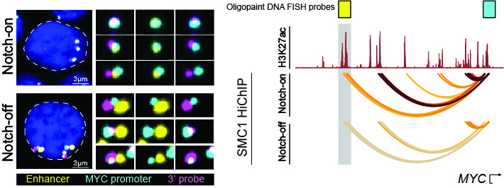

{:height="200%" width="200%"} 

Our lab focuses on understanding the mechanisms of epigenetic desregulation in cancer. We are particularly interested in understanding how signaling-dependent transcription factors such as Notch reorganize cancer epigenome. This mechanistic knowledge constitutes an important step toward leveraging selective disruption of epigenetic homeostasis as targeted therapeutic options. 

In our studies, we benefit from genome-wide assays elucidating the impact of transcription factors on chromatin folding and activity. We also use single-cell measurements to study how heterogeneity of chromatin activity (scATAC-seq) and folding (3D DNA FISH) impacts cancer cell response to targeted therapies.

In summary, we focus on the intersection of chromatin and cancer biology and blend in state-of-the-arts technologies to systematically elucidate: 

1. how epigenetic control of gene expression is disrupted in cancer, 

2. why transcriptional addiction can develop as a consequence of epigenetic aberrations, 

3. how heterogeneity and plasticity of transcriptional dependencies enable drug resistance. 

Passionate students and postdocs who are interested in investigating these questions are invited to read about our [research](04_research.html), checkout our available [positions](03_positions.html), and contact us for more details. 

----




Passionate students and postdocs who are interested in investigating these questions are invited to read about our [research](04_research.html), checkout our available [positions](03_positions.html), and contact us for more details. 


