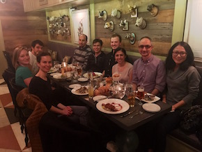

* [R. Babak Faryabi](PBabak.html), PhD, MSc

* [Gregory Schwartz](https://github.com/GregorySchwartz) joined the lab after his doctoral training at the Drexel University. Gregory interests lies in developing computational methods to integrate and interrogate high-dimensional experimental data sets using graph theory and machine learning. 
 
* [Yeqiao Zhou](https://twitter.com/YeqiaoZhou) is a PhD student at the Genetics and Epigenetics group. She is interested in interested in elucidating causes and consequences of connectome dysregulation in cancer. 

* Ashkan Bigledi joined the lab as a PhD student after his training in bioinformatics at Harvard. Ashakan is specialized in developing clinical sequencing workflows and researches pathogenic mutation prioritization.

* Benjamin Kahn did his undergraduate study at UPenn Health and Societies. He is interested in tumor vascularization.

* Parisa Samareh, GCB rotation student

**Alumni**

* Jose Liboy Lugo: Former: SUIP Undergrad, University of Puerto Rico

* Drishty Vora: Former: MS student of Biotech - Current: University of Pennsylvania Data Coordinator

* Rohan Alur: Former: undergraduate, Networked and Social Systems - Current: UPENN computer science, MS program

* Yeqiao Zhou: Former: Post-bac - Current: UPENN, Genetics and Epigenetics PhD program

* Thomas Campbell: Rotation student, BMB

* Tosin Ajiboye: Former: BSc (Laboratory Technician) - Current: North Philadelphia Health System

----
Lab photo at the end of Fall 2018 semester.

{:height="524px" width="349px"} 

We had many things to celebrate (Yeqiao's BD, our first HiCHiP data, and a productive Spring 2017 semester) with our colleagues at Vahedi Lab.

{:height="218px" width="290px"} 
