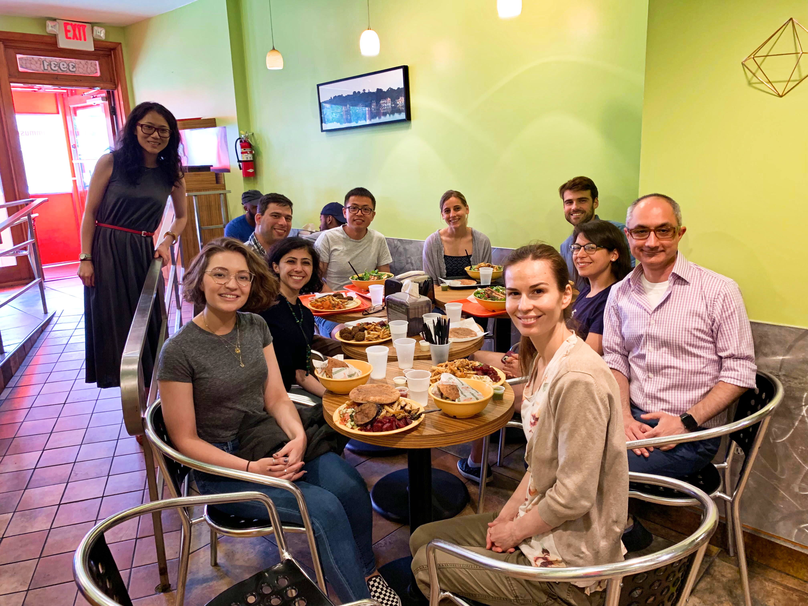

* [R. Babak Faryabi](PBabak.html), PhD, MSc

* [Yeqiao Zhou](https://twitter.com/YeqiaoZhou) is a PhD candidate at the Genetics and Epigenetics Graduate Group. She is interested in elucidating causes and consequences of genome misfolding in cancer. 

* [Gregory Schwartz](https://github.com/GregorySchwartz) joined the lab after his doctoral training at the Drexel University. Gregory interests lies in developing computational methods to integrate and interrogate high-dimensional experimental data sets using graph theory and machine learning. Dr. Schwartz research has been support by NIH T32 Immunobiology of Normal and Neoplastic Training Grant. 

* Bo He join the lab after his training at the City of Hope National Medical Center in cancer epigenetics. Bo is interested in understanding mechanisms of locus specific chromatin folding in Notch-mutated cancers. 

* Ashkan Bigledi joined the lab as a PhD student after his training in bioinformatics at Harvard. Ashakan is specialized in developing clinical sequencing workflows and researches pathogenic mutation prioritization.

* Brent Perlman is a student at Vagelos Program in Life Sciences & Management. He works on analysis and visualization of chromatin conformation data sets.

* Jingru Zhao is a Cell and Molecular Biology PhD student. She works on optical mapping of genome folding for her rotation project. 

**Alumni**

* Jelena Petrovic (joint with Warren Pear): Postdoctoral fellow - Current: Research Scientist at Genentech 

* Rupa Khanal is a rotation PhD studnet from the Department of Biology.

* Benjamin Kahn: Former: Undergraduate independent study - Current: MD/PhD student at Penn.

* Mark Boltengagen: Former: Postdoc - Current: Researcher at Dresden University of Technology.

* Parisa Samareh: Former: Rotation student, GCB

* Jose Liboy Lugo: Former: SUIP undergraduate student, University of Puerto Rico - Current: PhD student at UCSF

* Drishty Vora: Former: MS student of Biotech - Current: UPenn Data Coordinator

* Rohan Alur: Former: UPenn computer science, MS program - Current: Bridgewater Associates

* Yeqiao Zhou: Former: Post-bac - Current: UPENN, Genetics and Epigenetics PhD program

* Thomas Campbell: Rotation student, BMB

* Tosin Ajiboye: Former: Laboratory Technician - Current: North Philadelphia Health System

----

**Yeqiao passed her prelim with a full score.**

{:height="300px" width="400px"} 

**Lab photo at the end of Fall 2018 semester.**

{:height="524px" width="349px"} 

**We had many things to celebrate with our colleagues at Vahedi Lab (Yeqiao's BD, our first HiCHiP data, and a productive Spring 2017 semester).**

{:height="218px" width="290px"} 
