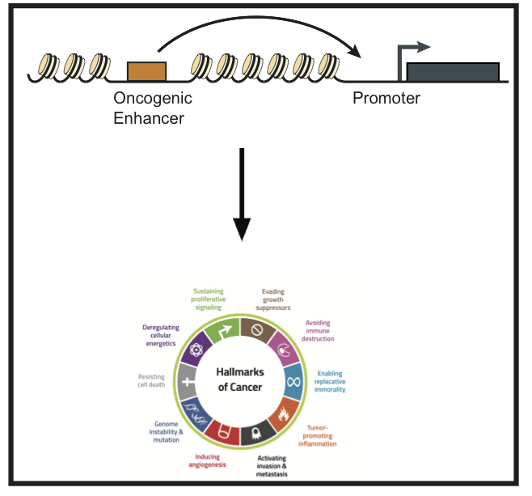
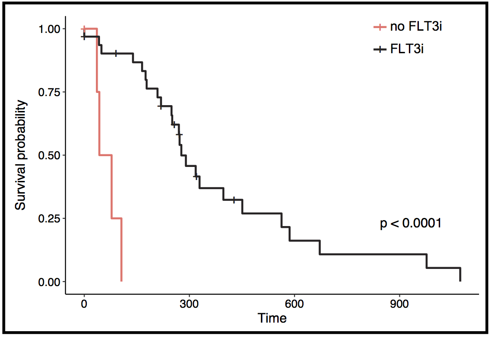

**What is our objective?** Despite the recent advances in cataloging frequent pathogenic mutational events in cancer, the efforts of scientific community to design effective and personalized treatment options are often hindered by the complexity of the disease. To untangle the complexity of tumor pathobiology, our lab focuses on understanding the mechanism of epigenetics dysregulation in cancer. Our specific goal is to elucidate how oncogenic signals such as Notch contribute to tumor pathogenicity through regulating its regulome and connectome, and to leverage this mechanistic understanding for improved treatments.

**What is our approach?** To investigate this question, we leverage our expertise in data-rich assays as well as computational biology and machine learning. Our lab exploits various established high-throughput assays with novel technologies such as [HiChIP](https://www.nature.com/nmeth/journal/v13/n11/full/nmeth.3999.html) to create a comprehensive and detailed map of regulome and connectome in Notch-driven tumors. 

We also benefit from cutting-edge single-cell genomics technologies to investigate the effect of tumor heterogeneity on response to Notch inhibitory agents. Our lab utilizes 10X Genomics and Fluidigm C1 platforms to assay transcriptomics and epigenomics at the single cell resolution, respectively. Our computational expertise enables us to also benefit from large amount of data already generated by cancer biologists and deposited in public domains. We harness the trove of public data to improve our hypotheses and strengthen our observations. 

The projects in the lab are broadly categorized into the following topics: 

----

**Understanding Notch-driven epigenetic dysregulation in cancer**

{:height="290px" width="300px"} 

Our lab deploys data-rich experimental techniques in combination with novel computational methods to elucidate how regulatory program of Notch-mutated tumors are defined. To create integrative maps of tumor-specific regulatory progam driving gene expression, we measure epigenetic state and 3D chromatin conformation of Notch-mutated tumors and integrate these multi-dementional data sets using concepts from data analytics, mathematical modeling, and machine learning. We interrogate these multi-omics models to elucidate regulatory circuits of genes with known role in tumorigensis and leverage this knowledge to identify epigenetic vulnerabilities to improve treatments in Notch-driven malignancies.

Tackling these questions also demainds new analythical approaches to investigate the data generated by these methods. For example, we are interested to learn how one can identify significant protein-mediated chromatin interactions from HiChIP data? How one could idetify differential 3D chromatin conformation in tumors to elucidate the role of chromatin topology in cancer?

----

**Mechanisms of drug resistant in cancer using single-cell epigenomics**

{:height="290px" width="300px"} 

To advance the development of novel multi-therapeutic strategies for acute lymphoblastic leukemia, we use single-cell transposase-accessible chromatin sequencing (scATAC-seq) to understand the mechanism of resistance due to the heterogeneity in tumors cells regulatory regions. To fully benefit from our scATAC-seq data, we also develop novel computational approaches with analysis of this data. 

For example, we are interested in understanding how epigenomics and transcriptomics heterogeneity could be quantified. What is the interplay between diversity in epigenetic program and gene expression? and which one is more predictive of drug response in breast cancer?

----

**Medical decision making algorithm in AML**

{:height="290px" width="300px"} 

Faryabi lab is also interested in developing computational oncology frameworks to enrich clinical significance of diagnostic tumor genomics to advance the paradigm of personalized medicine. To this end, we leverage clinical cases to investigate the correlation between the heterogeneity in mutational structures and response to targeted therapies. Adopting a “bedside to bench and back” approach, our aim is to identify tumor cell-specific vulnerabilities that could be exploited therapeutically.

   As part of the Center for Personalized Diagnostics, we have access to and mine cancer patient genotypic/phenotypic data sets to improve patient health. We recently developed an algorithm to accurately identify and characterize complex somatic mutations known as Internal Tandem Duplications (ITD) from short read sequencing data (300 pb). Observing limitations of short read sequencing, we brought in [10X Genomics](https://www.10xgenomics.com/genome/) micro-fluidic technology that enables sequencing very long DNA molecules. 
