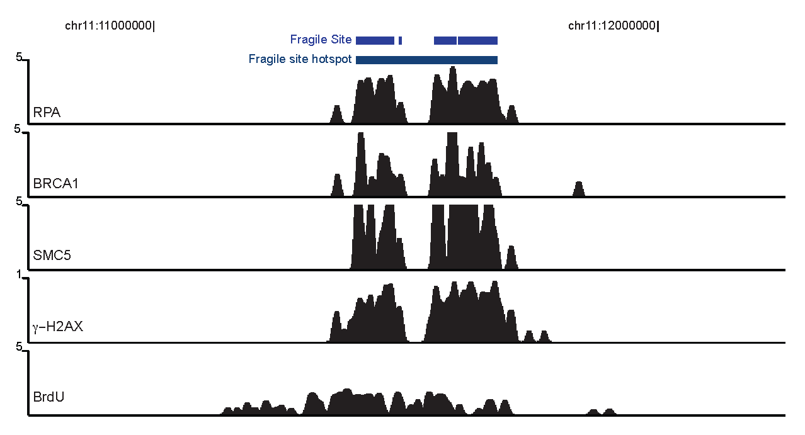

Mammalian cells orchestrate thousands of replication events along their genome.
Maintenance of genome integrity at the sites of DNA replication is a fundamental feature of proliferating cells and is essential for their survival and tissue homeostasis. Replication-mediated DNA damage triggers cascades of cellular responses known as DNA damage response (DDR). Wide array of endogenous factors and exogenous agents induce replication stress conditions. For the most part, DDR pathways counteract replicative stress and enable faithful replication of DNA during cell division. Nevertheless, Unfaithful repair of the replication-induced DNA double strand breaks, the most genotoxic form of replication-mediated DNA damage, can produce structural abnormalities that are reminiscent of those observed in cancers. Although the signaling cascades responding to replication-mediated breaks has been extensively studied, we know very little about the genome-wide footprints of various sources of replicative stress. 

The Faryabi Lab explores the genome-wide signatures of mechanistically distinct sources of replicative stress and investigates their contributions to hematological malignancies. More specifically, we strive to understand how various sources of intrinsic and/or extrinsic replicative stress shape the landscape of assaults on the genome integrity; and furthermore investigate how replication stress-induced DSB contributes to neoplastic structural variations observed in hematologic malignancies. 

High-throughput measurement technologies have made it possible to gather systems-level genomics, epigenomics, and functional genomics data on normal and perturbed cells. To better understand the role of DNA replication and repair mechanisms in shaping the genomic landscape of tumors, we use combinations of big data analytics, mathematical modeling and machine learning algorithms to integrate and interrogate high-dimensional data.  

As a member of Center for Personalized Diagnostics, Faryabi lab is interested in developing computational oncology frameworks to enrich clinical significance of diagnostic tumor genomics. To this end, we leverage clinical cases to investigate the contribution of impaired DNA replication and/or damage response machineries to tumor initiation, evolution and adaptation.  Adopting a “bedside to bench and back” approach, our aim is to identify tumor cell-specific vulnerabilities that could be exploited therapeutically.

