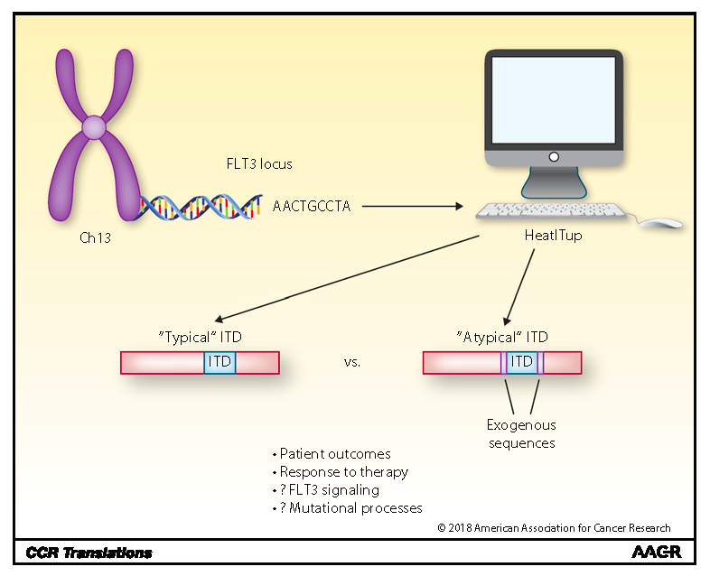

Cancer is typically considered a genetic disease. However, recent progress in our understanding of epigenetic aberrations in cancer has challenged this view. Overarching goal of our lab is to understand epigenetic mechanisms of transcriptional addiction in cancer and exploit this information to advance cancer therapeutics. 

To pursue these objectives, we use cutting-edge chromatin conformation capture, high-content Oligopaint DNA FISH, single-cell epigenomics, and functional genomics. We leverage our expertise in computational sciences to systematically explore the readouts of these data-rich assays to elucidate:  

----

**1. Understanding Notch-driven epigenetic program of solid and blood cancers.**

{:height="234px" width="415px"} 

Our lab deploys data-rich experimental techniques in combination with novel computational methods to elucidate epigenetic drivers of transcriptional addiction in Notch-mutated cancers. By measuring Notch impact on chromatin activity and topology, we create the highest possible resolution map of Notch-dependent regulatory maps. Using genetic approaches, we interrogate these maps to elucidate how aberrant epigenetic regulator promotes tumor growth and survival. These studies identify precise epigenetic vulnerabilities of cancer cells and guide treatments of Notch-addicted malignancies.  Refer to our manuscripts at [_Molecular Cell_](https://doi.org/10.1016/j.molcel.2019.01.006) and [_Cell Reports_](https://doi.org/10.1016/j.celrep.2017.09.066) for more details about our projects.   

----

**2. Elucidating the role of epigenetic heterogeneity and plasticity in resistance to Notch inhibitors.**

{:height="251px" width="592px"} 

Targeting oncogenic driver of cancers, such as Notch inhibitors, commonly leads to drug resistance. Mechanisms of acquiring resistance to oncology drugs mostly remain unknown, partly due to the limitations of population-based assays in elucidating heterogeneity of drug-naive and complexity of drug-induced tumor evolution. Using single-cell genomics and imaging, we investigate how heterogeneity and plasticity of transcriptional dependencies enables resistance to targeted therapeutics such as Notch inhibitors. For more information about these projects refer to [_Nature Methods_](https://doi.org/10.1038/s41592-020-0748-5) and [Pathology News](http://pathology.med.upenn.edu/news/faryabi-lab-receives-grant-transdisciplinary-awards-program-translational-medicine-and). 

----

**3. Medical decision-making algorithm in AML.**

[comment]: <{:height="290px" width="300px"}>
{:height="290px" width="300px"}

Our lab is also interested in developing computational oncology frameworks to enrich clinical significance of diagnostic tumor genomics to advance the paradigm of personalized medicine. To this end, we leverage clinical cases to investigate the correlation between the heterogeneity in mutational structures and response to targeted therapies. Adopting a “bedside to bench and back” approach, our aim is to identify tumor cell-specific vulnerabilities that could be exploited therapeutically. You could learn more about our project on  [_YouTube_](https://www.youtube.com/watch?v=vqLXfHXP98A&index=20&list=PLRGEsZTjjo8mLReT4vqHU6cc_d4hn46GV), [_Clinical Cancer Research_](https://doi.org/10.1158/1078-0432.CCR-18-0655) journal, and [_CCR Translations_](https://10.1158/1078-0432.CCR-18-3146).  

As part of the Center for Personalized Diagnostics, we have access to and mine cancer patient genotypic/phenotypic data sets to improve patient health. We recently developed [_HeatITup_](https://github.com/faryabib/HeatITup) algorithm to accurately identify and characterize complex somatic mutations known as Internal Tandem Duplications (ITD) from short read sequencing data (300 pb). Observing limitations of short read sequencing, we brought in [10X Genomics](https://www.10xgenomics.com/genome/) micro-fluidic technology that enables sequencing very long DNA molecules as single cell resolution. 
