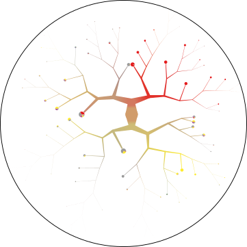
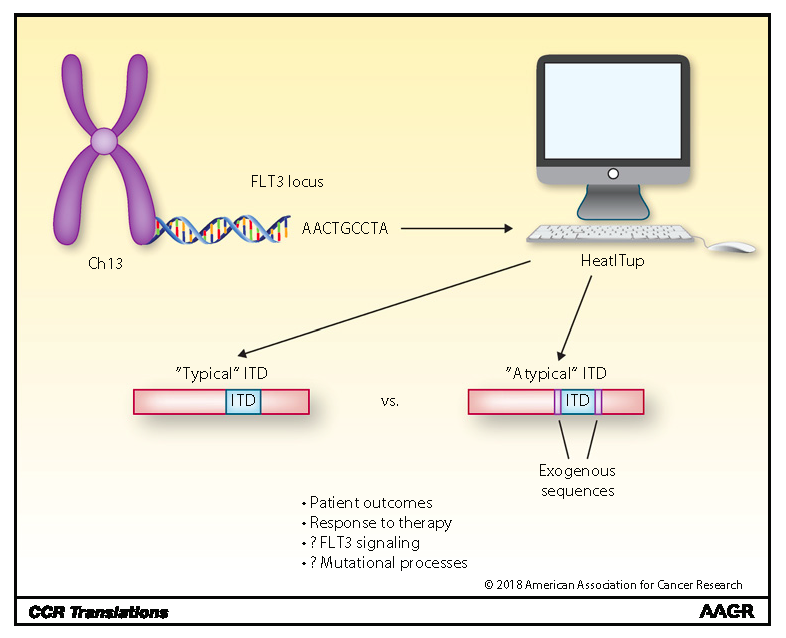

**[TooManyPeaks:](https://github.com/faryabib/too-many-cells)**

{:height="290px" width="300px"}

[TooManyPeaks:](https://github.com/faryabib/too-many-cells) New addition to our graph-based single-cell analysis environment that enables cell type prediction and visualization from single-cell ATAC-seq data. 

**[TooManyCells:](https://github.com/faryabib/too-many-cells)**

{:height="290px" width="300px"}

[TooManyCells:](https://github.com/faryabib/too-many-cells) A suite of graph-based tools for efficient, global, and unbiased identification and visualization of signle-cell RNA-seq clustering. More details about TooManyCells at [Nature Methods](https://doi.org/10.1038/s41592-020-0748-5). 

**[HeatITup:](https://github.com/faryabib/HeatITup)**

[comment]: <{:height="290px" width="300px"}>
{:height="290px" width="300px"}

[HEAT diffusion for Internal Tandem dUPlication (HeatITup):](https://github.com/faryabib/HeatITup) An algorithm for efficient and robust identification and classification of ITD mutations. More details about HeatITup at [Clinical Cancer Research](https://doi.org/10.1158/1078-0432.CCR-18-0655).

**[inteGREAT:](https://github.com/faryabib/inteGREAT)**

{:height="290px" width="300px"}

[inteGREAT:](https://github.com/faryabib/inteGREAT) A graph-based algorithm for robust and scalable differential integration of transcriptomic and proteomic measurements. More details about inteGREAT at [Frontiers in Genetics](https://doi.org/10.3389/fgene.2018.00205). 
