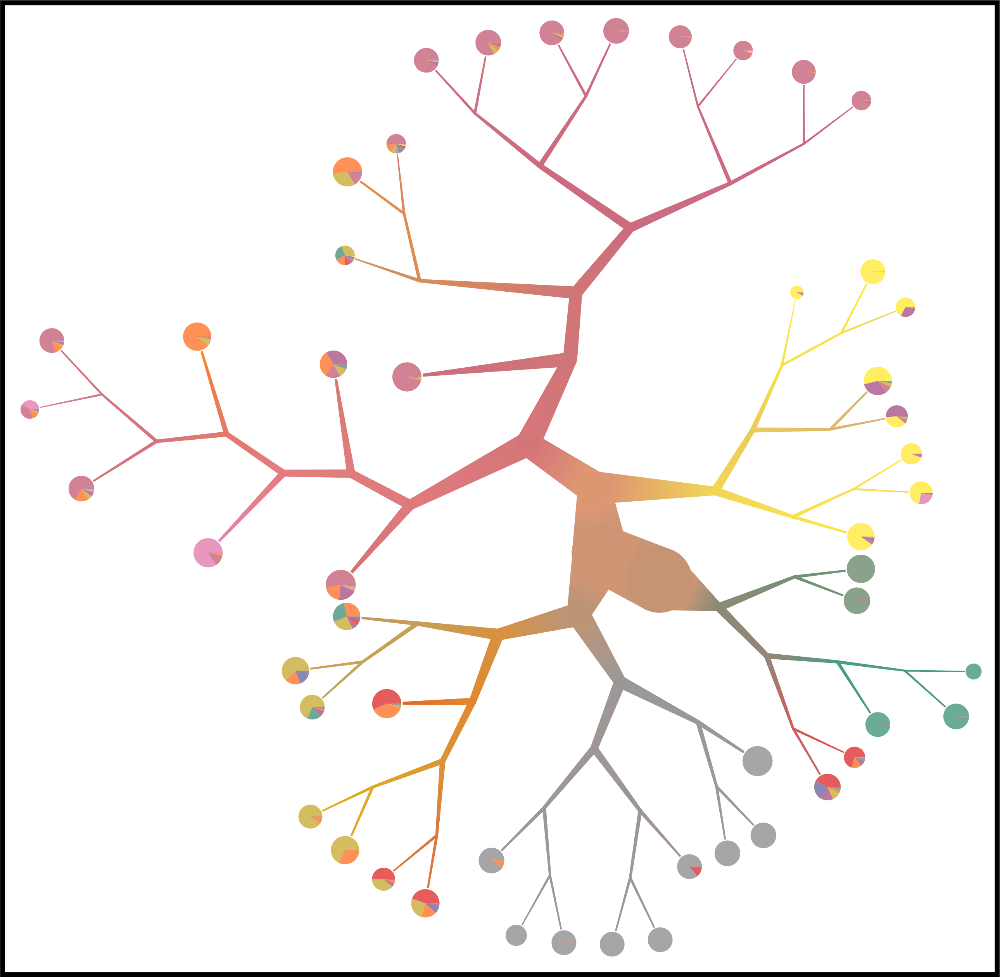
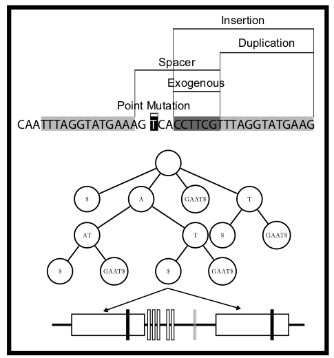
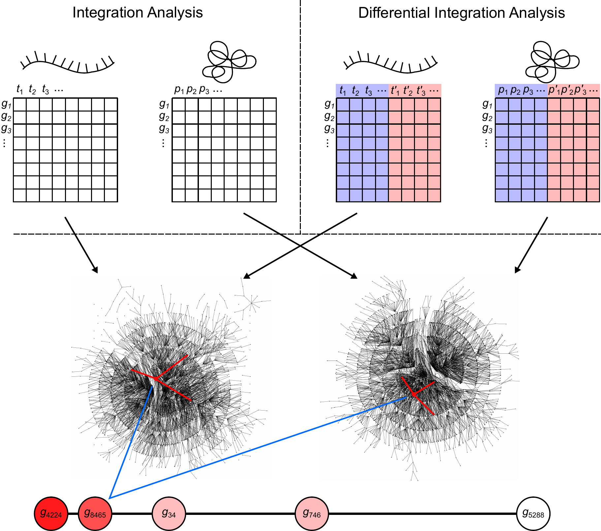

**[TooManyCells:](https://github.com/faryabiLab/too-many-cells)**

{:height="290px" width="300px"}

[TooManyCells:](https://github.com/faryabiLab/too-many-cells) A suite of graph-based tools for efficient, global, and unbiased identification and visualization of signle cell measurements clustering. More details about TooManyCells at [BioRxiv](). 

**[HeatITup:](https://github.com/faryabib/HeatITup)**

{:height="290px" width="300px"}

[HEAT diffusion for Internal Tandem dUPlication (HeatITup):](https://github.com/faryabib/HeatITup) An algorithm for efficient and robust identification and classification of ITD mutations. More details about HeatITup at [Clinical Cancer Research](http://clincancerres.aacrjournals.org/content/early/2018/09/01/1078-0432.CCR-18-0655).

**[inteGREAT:](https://github.com/faryabib/inteGREAT)**

{:height="290px" width="300px"}

[inteGREAT:](https://github.com/faryabib/inteGREAT) A graph-based algorithm for robust and scalable differential integration of transcriptomic and proteomic measurements. More details about inteGREAT at [Frontiers in Genetics](https://goo.gl/pvZ4Dn). 
